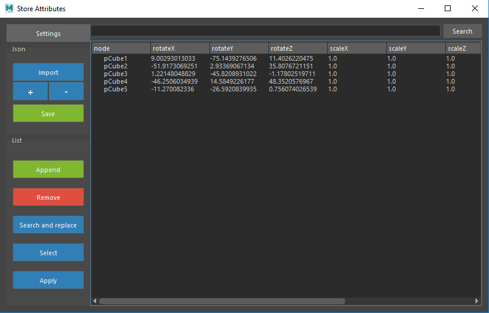

.. mayaTools documentation master file, created by
   sphinx-quickstart on Mon Feb 05 13:45:23 2018.
   You can adapt this file completely to your liking, but it should at least
   contain the root `toctree` directive.

Store Attributes
****************

Interface
=========

